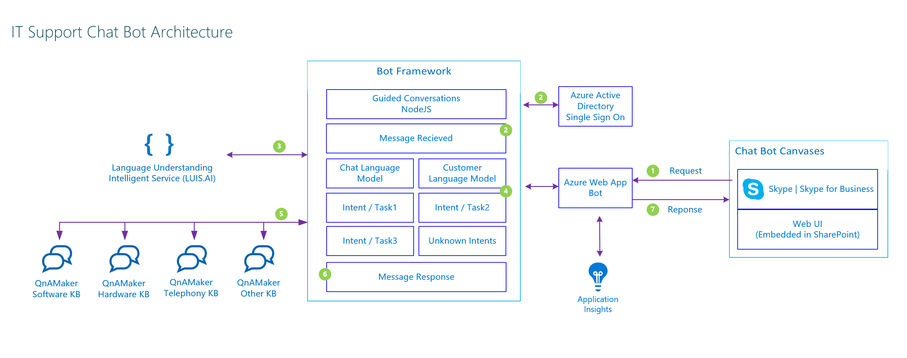
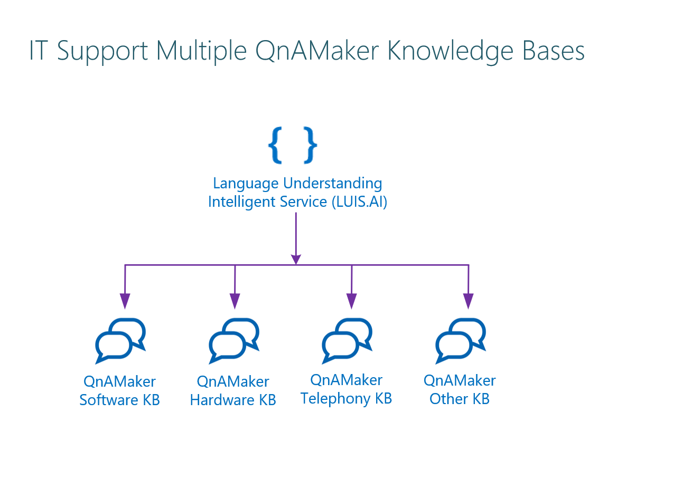

# Connecting a Chatbot with Multiple Knowledgebases - LUIS.AI with QnAMaker

[QnAMaker](www.QnAMaker.ai) is a great tool from Microsoft Cognitive Services.
With QnAMaker build, train and publish a simple question and answer bot based on FAQ URLs, structured documents, product manuals or editorial content in minutes.

[LUIS.AI](www.luis.ai), A machine learning-based service to build natural language into apps, bots, and IoT devices. Quickly create enterprise-ready, custom models that continuously improve.

In this sample we'll how to connect an NLP solution (LUIS) with a FAQ knowledge base (QnAMaker) using Node.js with Azure Bot Services.

Architecture for the project will be like below:

 

We'll use LUIS to detect Intent and Entities then we'll direct them into related knowledge bases in different QnAMaker sources.

 

.env file is empty, please provide your own credentials. 

## Use Visual Studio Code

### Build and debug
1. download source code zip and extract source in local folder
2. open the source folder in  Visual Studio Code
3. make code changes
4. download and run [botframework-emulator](https://emulator.botframework.com/)
5. connect the emulator to http://localhost:3987

## Use continuous integration

If you have setup continuous integration, then your bot will automatically deployed when new changes are pushed to the source repository.